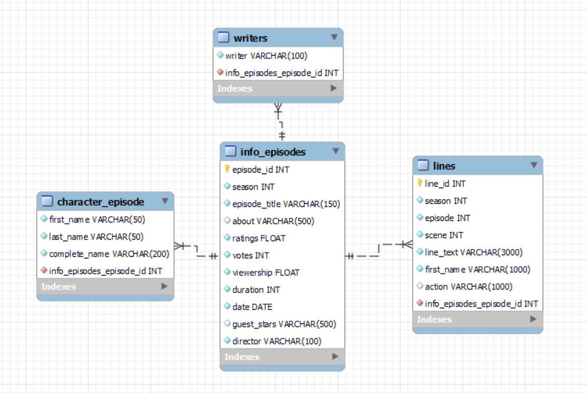

# The Office Data Analysis 💼📊🚀

Welcome to my repository! 😀 I am excited to share with you the results of my ETL (Extract, Transform, Load) project on The Office, a beloved American sitcom. This project involved extracting data from various sources using both API calls and web scraping techniques with <a href='https://www.selenium.dev/'>Selenium</a>, cleaning and preprocessing the data using the powerful <a href='https://pandas.pydata.org/'>Pandas</a> library in Python, and loading the data into a SQL database for further analysis and gaining insights about the show and its characters by visualizing the data using the <a href='https://seaborn.pydata.org/'>Seaborn</a> and <a href='https://matplotlib.org/stable/index.html'>Matplotlib</a> libraries.

## Objective:
The main objective of this project was to extract, clean, and analyze data from various sources in order to gain a deeper understanding of the show and its characters. I aimed to answer questions such as: What is the percentage of episodes each character appears in? And percentage of scenes? Which are the most frequent words said by every character? And more. Through this project, I hope to provide a comprehensive and detailed analysis of the show and its characters, as well as provide a deeper appreciation of the storytelling and characters in The Office.

## Navigating through the repository folders:

### Data 📥
This folder contains the following csv files:
- <a href="https://github.com/pauclaret/etl-project/blob/main/data/apiextraction.csv">apiextraction.csv</a>: This csv is the result of the extraction, cleaning, and processing made of the apiextraction.ipynb file.
- <a href="https://github.com/pauclaret/etl-project/blob/main/data/charactersepisode.csv">characterepisode.csv</a>: This csv is the result of the extraction, cleaning, and processing of the selenium imdb.ipynb file.
- <a href="https://github.com/pauclaret/etl-project/blob/main/data/infoepisodes.csv">infoepisodes.csv</a>: This csv is the result of the extraction, cleaning, and processing of the primeraextraction.ipynb file.
- <a href="https://github.com/pauclaret/etl-project/blob/main/data/writers.csv">writers.csv</a>: This csv is the result of the extraction, cleaning, and processing of the primeraextraction.ipynb file.
- <a href="https://github.com/pauclaret/etl-project/blob/main/data/lines.csv">lines.csv</a>: This csv is the result of the extraction, cleaning, and processing of the quotes csv.ipynb file.
- <a href="https://github.com/pauclaret/etl-project/blob/main/data/the_office_lines.csv">the_office_lines.csv</a>: This csv contains the data extracted from <a href="https://docs.google.com/spreadsheets/d/18wS5AAwOh8QO95RwHLS95POmSNKA2jjzdt0phrxeAE0/edit#gid=747974534">this</a> excel file.
- <a href="https://github.com/pauclaret/etl-project/blob/main/data/the_office_series.csv">the_office_series.csv</a>: This csv contains the data extracted from <a href="https://www.kaggle.com/datasets/nehaprabhavalkar/the-office-dataset">this</a> Kaggle dataset.

### Notebooks 📝
This folder contains the following files:

- <a href="https://github.com/pauclaret/etl-project/blob/main/notebooks/primeraextraction.ipynb">primeraextraction.ipynb</a>: This notebook is responsible for cleaning and preprocessing data extracted from <a href="https://www.kaggle.com/datasets/nehaprabhavalkar/the-office-dataset">this</a> Kaggle dataset using Pandas. The dataset consists of 12 columns and 188 rows, which were scrapped from IMDb. It contains information for every episode of The Office, such as viewership, duration, rating, etc.
- <a href="https://github.com/pauclaret/etl-project/blob/main/notebooks/apiextraction.ipynb">apiextraxtion.ipynb</a>: This notebook retrieves data from the <a href="https://officeapi.dev/api/characters/">The Office API</a>, processes it, and exports it to a CSV file using Pandas. The data retrieved contains the names of the most important characters of the sitcom.
- <a href="https://github.com/pauclaret/etl-project/blob/main/notebooks/quotes%20csv.ipynb">quotes csv.ipynb</a>: This notebook reads a CSV file containing information about every line said in the show, processes the data, and exports the cleaned data to a new CSV file using Pandas. The data is extracted from <a href="https://docs.google.com/spreadsheets/d/18wS5AAwOh8QO95RwHLS95POmSNKA2jjzdt0phrxeAE0/edit#gid=747974534">this</a> excel file.
- <a href="https://github.com/pauclaret/etl-project/blob/main/notebooks/selenium%20imdb.ipynb">selenium imdb.ipynb</a>: This notebook uses Selenium to extract data from the <a href="https://www.imdb.com/title/tt0386676/?ref_=nv_sr_srsg_0">IMDB website</a>, in order to know the characters that appear in every episode. It then cleans, processes, and exports the data to a CSV file using Pandas.
- <a href="https://github.com/pauclaret/etl-project/blob/main/notebooks/visualization.ipynb">visualization.ipynb</a>: This notebook uses the SQLAlchemy library to connect to the database, and then Pandas library is used to read and manipulate the data. The notebook uses several SQL queries to extract data from the database, and then the Seaborn and Matplotlib libraries are used to create visualizations of the data. The first query retrieves the first name and the percentage of episodes in which the character appears. The second query retrieves the first name and the percentage of scenes in which the character appears. The third query retrieves the first name and the mean number of lines spoken per episode by characters who appeared in at least six episodes throughout the entire series. The fourth query retrieves the season and the proportion of lines spoken by Michael, Dwight, Jim, Pam, and Andy.

### Images 🖼️
In this folder, you will find the visualizations created using Matplotlib and Seaborn in the <a href="https://github.com/pauclaret/etl-project/blob/main/notebooks/visualization.ipynb">visualization.ipynb</a> notebook. These visualizations, such as bar charts, line plots, and scatter plots, will help you understand the insights and conclusions I obtained from the data by providing a clear and intuitive representation of the information. They allow you to quickly identify patterns and trends, providing a deeper understanding of the data and making it easier to communicate the findings to others. The use of different visualization techniques and libraries also enables flexibility and customization, allowing for the creation of more visually appealing and informative figures.

### Src 🔧
 It contains a <a href="https://github.com/pauclaret/etl-project/blob/main/src/support.py">Python file</a> that contains two functions: "analyze_dataframe()" and "reset_and_rename_index()". The first function prints various information about a dataframe, such as its shape, columns, missing values, data types, head, and describe. The second function resets the index of a dataframe, renames the index column, resets the index again and drops the index column.

### Database 🗄️
This folder contains the <a href="https://github.com/pauclaret/etl-project/blob/main/database/scriptsql.sql">SQL script</a> used to create the database, as well as a <a href="https://github.com/pauclaret/etl-project/blob/main/database/alchemy.ipynb">.ipynb file</a> containing the SQL queries made with SQL Alchemy, used to insert the information from every csv file created in the data extraction, cleaning, and processing stages of the project into this new SQL database. The SQL script is used to create the necessary tables and schema in the database, while the SQL queries are used to populate these tables with the relevant data from the CSV files. This allows for easy querying and analysis of the data in a structured format.

 

### Libraries 📚
Here are some of the libraries I used in this project:
- <a href="https://pandas.pydata.org/">pandas</a>: a library that provides fast, flexible, and expressive data structures designed to make working with "relational" or "labeled" data both easy and intuitive.
- <a href="https://www.sqlalchemy.org/">sqlalchemy</a>: a library that provides a nice API to interact with SQL databases.
- <a href="https://numpy.org/">numpy</a>: a library that provides support for large, multi-dimensional arrays and matrices of numerical data.
- <a href="https://matplotlib.org/stable/index.html">matplotlib</a>: a library that provides functions for creating static, animated, and interactive visualizations in Python.
- <a href="https://seaborn.pydata.org/">seaborn</a>: a library that is built on top of matplotlib and provides a more powerful API for creating visualizations.
- <a href="https://www.selenium.dev/documentation/en/">selenium</a>: a library that allows you to automate web browsers and interact with web pages programmatically.
- <a href="https://requests.readthedocs.io/en/master/">requests</a>: a library that allows you to send HTTP requests in Python and handle the response.

<strong>I hope you enjoy exploring the project as much as I enjoyed creating it!</strong> 🧑‍💻
